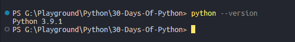
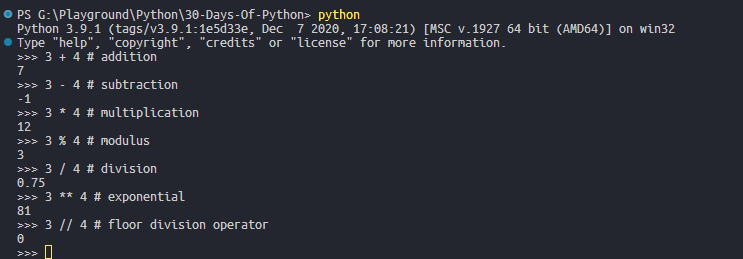
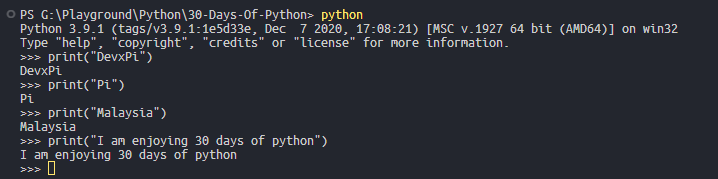
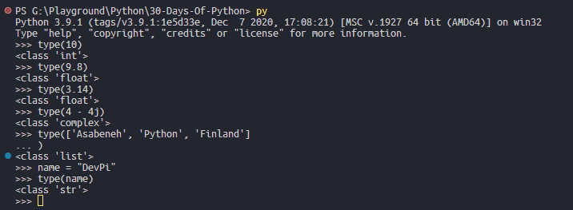

# 💻 Exercises - Day 1

## Exercise: Level 1

1. Check the python version you are using
   

2. Open python interactive shell and do the following operations. The operands are 3 and 4.
   
   
3. Write string on python interactive shell. The strings are the following:
   - your name
   - your family name
   - your country
   - I am enjoying 30 days of python

   
  
4. Check the data type of following data.
   - 10
   - 9.8
   - 3.14
   - 4 - 4j
   - ['Asabeneh', 'Python', 'Finland']
   - Your name
   - Your family name
   - Your country

   